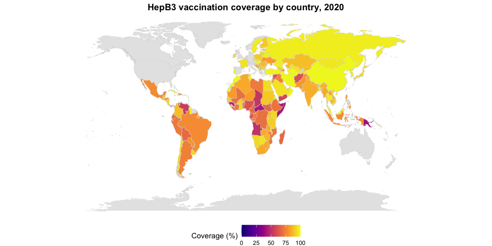
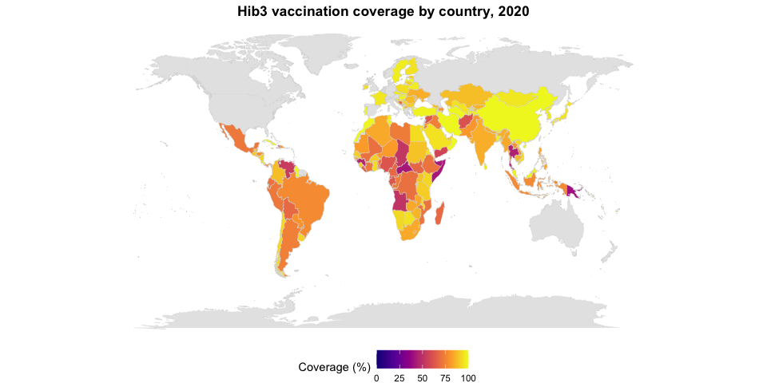
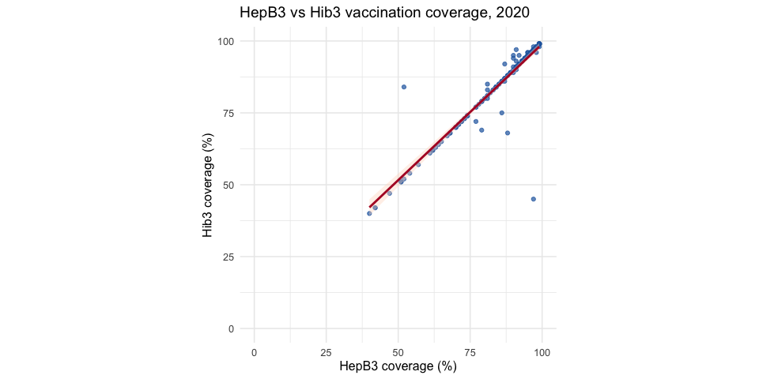

Hepatitis B (HepB3) and Hib3 Vaccination Coverage in 2020
================

## Introduction

This report compares national **Hepatitis B third-dose (HepB3)** and
**Haemophilus influenzae type b third-dose (Hib3)** vaccination coverage
in **2020**, using country-level estimates from the provided datasets.

## Data overview

A sample of each source file:

| geo | name | 1991 | 1992 | 1993 | 1994 | 1995 | 1996 | 1997 | 1998 | 1999 | 2000 | 2001 | 2002 | 2003 | 2004 | 2005 | 2006 | 2007 | 2008 | 2009 | 2010 | 2011 | 2012 | 2013 | 2014 | 2015 | 2016 | 2017 | 2018 | 2019 | 2020 | 2021 | 2022 | 2023 |
|:---|:---|---:|---:|---:|---:|---:|---:|---:|---:|---:|---:|---:|---:|---:|---:|---:|---:|---:|---:|---:|---:|---:|---:|---:|---:|---:|---:|---:|---:|---:|---:|---:|---:|---:|
| afg | Afghanistan | NA | NA | NA | NA | NA | NA | NA | NA | NA | NA | NA | NA | NA | NA | NA | NA | 63 | 64 | 63 | 66 | 68 | 66 | 64 | 63 | 64 | 65 | 63 | 67 | 65 | 61 | 55 | 58 | 60 |
| ago | Angola | NA | NA | NA | NA | NA | NA | NA | NA | NA | NA | NA | NA | NA | NA | NA | NA | 43 | 45 | 47 | 49 | 50 | 52 | 54 | 55 | 59 | 59 | 56 | 63 | 57 | 51 | 45 | 42 | 54 |
| alb | Albania | NA | NA | NA | NA | NA | NA | NA | NA | NA | 96 | 96 | 96 | 97 | 99 | 98 | 98 | 98 | 99 | 98 | 99 | 99 | 99 | 99 | 98 | 99 | 98 | 99 | 99 | 99 | 98 | 98 | 97 | 97 |
| and | Andorra | NA | NA | NA | NA | NA | NA | NA | 55 | 80 | NA | NA | NA | NA | NA | NA | NA | NA | NA | NA | NA | NA | NA | NA | NA | NA | NA | NA | NA | NA | NA | NA | NA | NA |
| are | UAE | NA | NA | NA | NA | NA | NA | NA | NA | 94 | 92 | 92 | 92 | 92 | 92 | 92 | 92 | 92 | 92 | 93 | 94 | 95 | 96 | 98 | 99 | 99 | 99 | 98 | 99 | 98 | 91 | 95 | 95 | 96 |
| arg | Argentina | NA | NA | NA | NA | NA | NA | NA | 49 | 86 | NA | NA | 66 | 73 | 81 | 88 | 84 | 85 | 90 | 94 | 94 | 91 | 91 | 94 | 94 | 94 | 92 | 86 | 86 | 83 | 74 | 81 | 84 | 66 |

| geo | name | 1989 | 1990 | 1991 | 1992 | 1993 | 1994 | 1995 | 1996 | 1997 | 1998 | 1999 | 2000 | 2001 | 2002 | 2003 | 2004 | 2005 | 2006 | 2007 | 2008 | 2009 | 2010 | 2011 | 2012 | 2013 | 2014 | 2015 | 2016 | 2017 | 2018 | 2019 | 2020 | 2021 | 2022 | 2023 |
|:---|:---|---:|---:|---:|---:|---:|---:|---:|---:|---:|---:|---:|---:|---:|---:|---:|---:|---:|---:|---:|---:|---:|---:|---:|---:|---:|---:|---:|---:|---:|---:|---:|---:|---:|---:|---:|
| afg | Afghanistan | NA | NA | NA | NA | NA | NA | NA | NA | NA | NA | NA | NA | NA | NA | NA | NA | NA | NA | NA | NA | 63 | 66 | 68 | 66 | 64 | 63 | 64 | 65 | 63 | 67 | 65 | 61 | 55 | 58 | 60 |
| ago | Angola | NA | NA | NA | NA | NA | NA | NA | NA | NA | NA | NA | NA | NA | NA | NA | NA | NA | NA | 43 | 45 | 47 | 49 | 50 | 52 | 54 | 55 | 59 | 59 | 56 | 63 | 57 | 51 | 45 | 42 | 54 |
| alb | Albania | NA | NA | NA | NA | NA | 99 | 88 | 96 | 97 | 94 | 96 | NA | NA | NA | NA | NA | NA | NA | NA | NA | 98 | 99 | 99 | 99 | 99 | 98 | 99 | 98 | 99 | 99 | 99 | 98 | 98 | 97 | 97 |
| and | Andorra | NA | NA | NA | NA | NA | NA | NA | NA | 75 | 80 | 75 | NA | NA | NA | NA | NA | NA | NA | NA | NA | NA | NA | NA | NA | NA | NA | NA | NA | NA | NA | NA | NA | NA | NA | NA |
| are | UAE | NA | NA | NA | NA | 90 | 90 | 90 | 90 | 90 | 96 | 92 | 92 | 92 | 94 | 94 | 94 | 94 | 92 | 92 | 92 | 93 | 94 | 95 | 96 | 98 | 99 | 99 | 99 | 98 | 99 | 99 | 90 | 96 | 96 | 96 |
| arg | Argentina | NA | NA | NA | NA | NA | NA | NA | NA | NA | NA | NA | 83 | 83 | 93 | 96 | 98 | 98 | 91 | 91 | 93 | 94 | 94 | 91 | 91 | 94 | 94 | 94 | 92 | 86 | 86 | 83 | 74 | 81 | 84 | 66 |

## 2020 coverage

Each indicator is restricted to **2020**; countries without a reported
value are excluded from numeric summaries but still appear as missing on
the maps.

| Indicator | Countries | Median_coverage | Mean_coverage |
|:---|---:|---:|---:|
| HepB3 | 161 | 89.0 | 84.8 |
| Hib3 | 161 | 89.0 | 84.6 |
| HepB3 (countries with both indicators) | 160 | 89.0 | 84.7 |
| Hib3 (countries with both indicators) | 160 | 89.0 | 84.5 |
| Both vaccines — estimated joint coverage | 160 | 79.2 | 73.4 |

Among the 160 countries with 2020 data for **both** indicators, the
estimated share of children receiving **both** HepB3 and Hib3 is
**73.4%** on average (median **79.2%**). This uses each country’s
formula (HepB3% × Hib3% ÷ 100), then averages across countries; it is an
unweighted country mean, not a global population total.

## World maps (2020)

### HepB3 vaccination coverage

<!-- -->

### Hib3 vaccination coverage

<!-- -->

## Relationship between HepB3 and Hib3 (2020)

<!-- -->

Among 160 countries with both indicators reported in 2020, the Pearson
correlation is **0.93**.

## Interpretation

HepB3 and Hib3 coverage in 2020 are **strongly positively associated**:
countries with higher HepB3 coverage tend to have higher Hib3 coverage,
and the scatterplot points cluster close to the diagonal. The high
correlation (0.93) suggests that both indicators largely reflect the
same underlying strength of routine immunization systems rather than
independent program performance.

The world maps show similar geographic patterns for both vaccines—high
coverage across much of the Americas, Europe, and parts of Asia, and
lower coverage in several countries in sub-Saharan Africa and a few
other regions. Large gaps on the maps (grey countries) indicate missing
2020 estimates rather than zero coverage.

Together, the maps and scatterplot indicate that **gains in one
third-dose vaccine are typically accompanied by gains in the other**,
which is consistent with both being delivered through routine childhood
immunization schedules in the same health systems.
